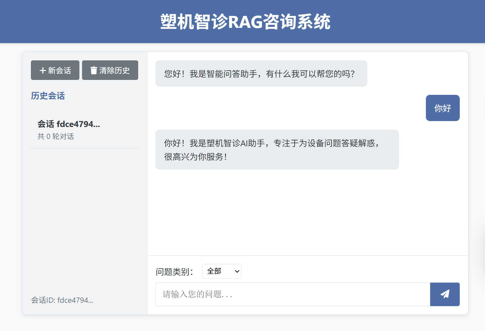

# 塑机智诊 RAG 咨询系统

一个面向注塑机设备故障排查场景的智能问答系统。系统优先从 MySQL 问答库中检索已有答案；没有匹配到可靠答案时，再使用 RAG（检索增强生成）从设备资料中检索相关内容，并调用大语言模型生成回答。

项目使用 FastAPI 提供网页、HTTP API 和 WebSocket 服务，前端采用原生 HTML、CSS、JavaScript 实现。

## 主要功能

- 注塑机设备故障问答
- MySQL + BM25 快速匹配标准问答
- 基于 Milvus 的设备文档向量检索
- 大语言模型生成 RAG 回答
- WebSocket 流式输出回答
- 按问题类别过滤知识来源
- 基于 UUID 区分不同会话
- 在 MySQL 中保存最近 5 轮对话
- 支持 PDF、Word、PPT 和图片等知识文档

## 系统工作流程

```text
用户在网页输入问题
        │
        ▼
FastAPI 接收 POST /api/query
        │
        ├── 命中固定问候语 ──────────────► 直接返回模板回答
        │
        ▼
MySQL + BM25 检索标准问答
        │
        ├── 找到可靠答案 ────────────────► 返回完整 JSON 回答
        │
        ▼
RAG 检索设备文档 + 大语言模型生成
        │
        ▼
WebSocket /api/stream 逐段返回回答
        │
        ▼
完整问答保存到 MySQL
```

## 技术栈

| 类型 | 技术 |
|---|---|
| Web 后端 | FastAPI、Uvicorn |
| Web 前端 | HTML、CSS、JavaScript |
| 流式通信 | WebSocket |
| 标准问答检索 | MySQL、BM25、Redis |
| 向量数据库 | Milvus |
| 嵌入与重排序 | BGE-M3、BGE-Reranker |
| 大语言模型 | 兼容 OpenAI API 的 DashScope 模型 |
| 文档处理 | PyMuPDF、python-docx、python-pptx、OCR |

## 项目结构

```text
Education-RAG/
├── app.py                         # FastAPI 服务入口和所有 Web 路由
├── main.py                        # MySQL、BM25 与 RAG 的统一问答逻辑
├── config.ini                     # 本地配置文件，不应提交真实密钥
├── config.ini.example             # 配置文件示例
├── requirements.txt               # Python 依赖
├── base/
│   ├── config.py                  # 读取配置和环境变量
│   └── logger.py                  # 日志配置
├── static/
│   ├── index.html                 # 当前实际使用的前端页面
│   ├── old_index.html             # 旧版前端页面
│   └── src/App.jsx                # 未接入当前页面的 React 草稿
├── mysql_qa/
│   ├── data/                      # 标准问答数据
│   ├── db/mysql_client.py         # MySQL 客户端
│   ├── cache/redis_client.py      # Redis 客户端
│   ├── retrieval/bm25_search.py   # BM25 检索
│   └── sql_main.py                # MySQL 问答命令行入口
├── rag_qa/
│   ├── core/rag_system.py         # RAG 回答生成
│   ├── core/vector_store.py       # Milvus 向量存储与检索
│   ├── data/                      # 知识库原始文档
│   ├── models/                    # 本地嵌入、分类与重排序模型
│   ├── edu_document_loaders/      # 多格式文档加载器
│   └── rag_main.py                # 文档入库和 RAG 命令行入口
└── logs/app.log                   # 运行日志
```

> 当前 Web 页面由 `app.py` 返回 `static/index.html`。修改页面时不要改错为根目录文件、`old_index.html` 或 `static/src/App.jsx`。

## 运行环境

建议环境：

- Python 3.10 或 3.11
- MySQL
- Redis
- Milvus
- 可用的 DashScope API Key
- Windows、Linux 或 macOS

本项目包含本地模型和文档处理依赖，首次安装可能耗时较长，并占用较多磁盘空间。

## 快速开始

### 1. 创建虚拟环境

在项目根目录执行：

```powershell
python -m venv .venv
.\.venv\Scripts\Activate.ps1
```

Linux 或 macOS：

```bash
python3 -m venv .venv
source .venv/bin/activate
```

### 2. 安装依赖

```powershell
python -m pip install --upgrade pip
pip install -r requirements.txt
```

### 3. 创建配置文件

Windows PowerShell：

```powershell
Copy-Item config.ini.example config.ini
```

Linux 或 macOS：

```bash
cp config.ini.example config.ini
```

然后按照自己的环境修改 `config.ini`：

```ini
[mysql]
host = 127.0.0.1
port = 3306
user = root
password = 请填写MySQL密码
database = subjects_kg

[redis]
host = 127.0.0.1
port = 6379
password = 请填写Redis密码
db = 0

[milvus]
host = 127.0.0.1
port = 19530
database_name = itcast
collection_name = injection_machine_rag

[llm]
model = 请填写模型名称
dashscope_api_key = 请填写API密钥
dashscope_base_url = https://dashscope.aliyuncs.com/compatible-mode/v1

[app]
valid_sources = ["液压系统", "电气系统", "合模机构", "注射机构", "温控系统"]
customer_service_phone = 13000000000
```

不要把真实密码或 API Key 提交到 Git 仓库。也可以通过环境变量提供配置，例如 `MYSQL_PASSWORD`、`DASHSCOPE_API_KEY` 和 `VALID_SOURCES`。

### 4. 准备外部服务

启动应用之前，确保以下服务可以连接：

1. MySQL 已启动，并已创建 `config.ini` 中指定的数据库。
2. Redis 已启动，端口和密码正确。
3. Milvus 已启动，并已创建配置中指定的数据库。
4. DashScope API Key 有效。

应用初始化时会自动创建 MySQL 对话历史表 `conversations`。

### 5. 启动 Web 服务

```powershell
python app.py
```

看到 Uvicorn 启动信息后，在浏览器打开：

```text
http://127.0.0.1:8003/
```

API 交互文档：

```text
http://127.0.0.1:8003/docs
```

健康检查：

```text
http://127.0.0.1:8003/health
```

如果修改前端后仍显示旧页面，可以按 `Ctrl + F5` 强制刷新浏览器缓存。

## 导入 RAG 知识文档

问题类别来自 `config.ini` 的 `valid_sources`。数据处理程序会按下面的规则寻找目录：

```text
<数据根目录>/<问题类别>_data/
```

例如：

```text
rag_qa/data/
├── 液压系统_data/
├── 电气系统_data/
├── 合模机构_data/
├── 注射机构_data/
└── 温控系统_data/
```

把设备说明书、维修手册等资料放入对应目录后执行：

```powershell
python rag_qa/rag_main.py --data-processing --data-dir rag_qa/data
```

程序会读取文档、切分文本、生成向量，并写入 Milvus。重复执行前应确认当前向量存储的去重策略，避免重复导入相同资料。

## API 路由

| 请求方式 | 路径 | 作用 |
|---|---|---|
| GET | `/` | 返回 `static/index.html` |
| POST | `/api/create_session` | 创建新的 UUID 会话 ID |
| POST | `/api/query` | 提交问题并判断是否需要流式回答 |
| WebSocket | `/api/stream` | 流式返回 RAG 回答 |
| GET | `/api/history/{session_id}` | 获取当前会话最近 5 轮历史 |
| DELETE | `/api/history/{session_id}` | 删除当前会话历史 |
| GET | `/api/sources` | 获取有效的问题类别 |
| GET | `/health` | Web 服务健康检查 |

### 创建会话示例

请求：

```http
POST /api/create_session
```

响应：

```json
{
  "session_id": "550e8400-e29b-41d4-a716-446655440000"
}
```

### 提交问题示例

```http
POST /api/query
Content-Type: application/json
```

```json
{
  "query": "注塑机油温过高应该怎样排查？",
  "source_filter": "液压系统",
  "session_id": "550e8400-e29b-41d4-a716-446655440000"
}
```

直接回答时返回：

```json
{
  "answer": "请依次检查冷却水路、油位、过滤器和液压泵负载……",
  "is_streaming": false,
  "session_id": "550e8400-e29b-41d4-a716-446655440000",
  "processing_time": 0.15
}
```

当 `is_streaming` 为 `true` 时，前端会继续连接 WebSocket `/api/stream` 获取逐段生成的回答。

## 前后端交互说明

页面加载完成后会自动执行：

1. `POST /api/create_session`：创建当前会话。
2. `GET /api/sources`：加载问题类别下拉框。

用户提交问题后：

1. 前端使用 `fetch()` 请求 `POST /api/query`。
2. 后端优先检查固定问候语和 MySQL/BM25 标准答案。
3. 如果可以直接回答，前端显示返回的 `answer`。
4. 如果需要 RAG，前端建立 WebSocket 连接。
5. 后端不断发送 `start`、`token`、`end` 消息。
6. 前端累积 token，并使用 `marked.js` 渲染 Markdown。
7. 回答完成后，前端重新读取会话历史。

## 常见问题

### 修改前端后没有变化

确认修改的是：

```text
static/index.html
```

然后访问 `http://127.0.0.1:8003/` 并按 `Ctrl + F5`。`<title>` 只控制浏览器标签名称，页面顶部文字由 `<h1>` 控制。

### 手机无法访问 `127.0.0.1:8003`

手机中的 `127.0.0.1` 指手机自身。手机与电脑在同一局域网时，应使用电脑的局域网地址，例如：

```text
http://192.168.1.100:8003/
```

同时需要允许 Windows 防火墙访问 8003 端口。

### 页面能打开，但提问失败

检查：

- MySQL、Redis 和 Milvus 是否已经启动
- `config.ini` 的端口、账号和密码是否正确
- DashScope API Key 是否有效
- `logs/app.log` 中是否记录了连接或模型错误

### 下拉框仍显示旧的问题类别

下拉框内容不是写死在 HTML 中，而是由 `/api/sources` 返回。请修改 `config.ini`：

```ini
[app]
valid_sources = ["液压系统", "电气系统", "合模机构", "注射机构", "温控系统"]
```

修改后重启 FastAPI 服务。

## 开发说明

- 当前生产页面是 `static/index.html`，不是 React 的 `static/src/App.jsx`。
- `app.py` 默认监听 `0.0.0.0:8003`。
- `/api/query` 用于直接答案和流式判断，`/api/stream` 用于实际的 RAG 流式输出。
- 会话历史以 `session_id` 为键保存到 MySQL，最多保留最近 5 轮。
- 运行日志默认写入 `logs/app.log`。

## 安全建议

正式部署前建议：

- 使用 HTTPS 和 WSS。
- 不要在仓库中保存数据库密码和 API Key。
- 为 API 增加身份认证、访问频率限制和输入长度限制。
- 将 CORS 限制为真实前端域名。
- 对 Markdown 生成的 HTML 进行清理，降低 XSS 风险。
- 定期备份 MySQL 与 Milvus 数据。

## License

本项目的授权方式请参见 [LICENSE](LICENSE)。
